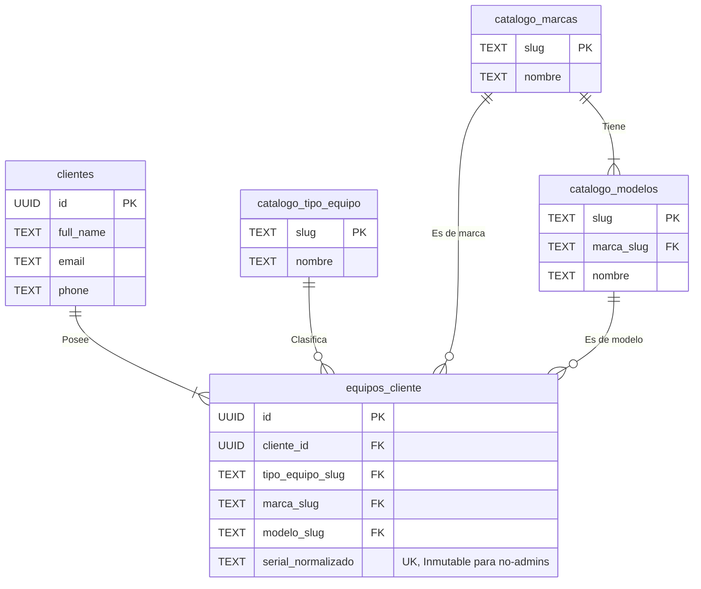

# [Sección 3] — Módulo de Clientes y Equipos

## 1. Resumen del Módulo

Este módulo establece la base para la gestión de la información de los clientes y los equipos que traen al taller. Es un prerrequisito fundamental para la creación de Órdenes de Trabajo, ya que cada OT debe estar vinculada a un cliente y a un equipo específico.

El diseño se centra en la normalización y la integridad de los datos a través de catálogos y reglas de negocio aplicadas a nivel de base de datos.

**Entidades Principales:**
-   **`clientes`**: Almacena la información de contacto y fiscal de cada cliente.
-   **`catalogo_tipo_equipo`**: Catálogo para clasificar equipos (e.g., 'laptop', 'impresora').
-   **`catalogo_marcas`**: Catálogo de marcas de equipos (e.g., 'hp', 'dell').
-   **`catalogo_modelos`**: Catálogo de modelos, vinculados a una marca específica.
-   **`equipos_cliente`**: Tabla principal que asocia un equipo (con su tipo, marca, modelo y serial) a un cliente.

**Reglas de Negocio Clave:**
1.  **Serial Normalizado e Inmutable:** El número de serie se almacena en una columna `serial_normalizado` (sin espacios, mayúsculas, etc.) para búsquedas consistentes. Una vez creado un equipo, este campo no puede ser modificado por usuarios que no sean administradores, garantizando la integridad del historial del equipo.
2.  **Consistencia Marca-Modelo:** La tabla `catalogo_modelos` tiene una clave foránea a `catalogo_marcas`, asegurando que un modelo siempre pertenezca a la marca correcta.

---

## 2. Diagrama de Entidades (Mermaid)



---

## 3. Pasos de Implementación y Verificación

Sigue estos pasos en el **SQL Editor** de tu proyecto Supabase para desplegar el módulo.

1.  **Ejecutar Script de Tablas y Funciones:**
    -   Copia el contenido de `supabase/sql/04_clientes_equipos.sql`.
    -   Pégalo en una nueva consulta y ejecútalo. Esto creará las tablas, catálogos, funciones y triggers necesarios.

2.  **Ejecutar Script de Políticas de Seguridad (RLS):**
    -   Copia el contenido de `supabase/sql/05_rls_clientes_equipos.sql`.
    -   Pégalo en una nueva consulta y ejecútalo. Esto activará RLS y aplicará las políticas de acceso para cada rol.

---

## 4. Pruebas Manuales de Políticas RLS

Ejecuta estas consultas en el **SQL Editor** para verificar que las políticas de seguridad funcionan como se espera. **Recuerda reemplazar los `<UUID_...>` por los IDs reales de tus usuarios de prueba.**

### Como `admin@local` (Acceso Total)
```sql
DO $$
DECLARE
  new_client_id UUID := gen_random_uuid();
  new_equipment_id UUID;
BEGIN
  -- Simular sesión de admin
  SET LOCAL ROLE authenticator;
  SET LOCAL "request.jwt.claims" TO '{"sub": "<UUID_DEL_ADMIN>", "role": "authenticated"}';

  RAISE NOTICE '✅ [Admin] Intentando crear un cliente...';
  INSERT INTO public.clientes (id, full_name, email, phone, fiscal_id, client_category)
  VALUES (new_client_id, 'Cliente Creado Por Admin', 'client_admin@test.com', '111', '111', 'Individual');
  RAISE NOTICE 'ÉXITO: Admin creó cliente.';

  RAISE NOTICE '✅ [Admin] Intentando crear un equipo para el cliente...';
  INSERT INTO public.equipos_cliente (cliente_id, tipo_equipo_slug, marca_slug, modelo_slug, serial)
  VALUES (new_client_id, 'laptop', 'hp', 'pavilion', 'SERIAL_ADMIN_123')
  RETURNING id INTO new_equipment_id;
  RAISE NOTICE 'ÉXITO: Admin creó equipo.';

  RAISE NOTICE '✅ [Admin] Intentando actualizar el serial del equipo...';
  UPDATE public.equipos_cliente SET serial = 'SERIAL_MODIFICADO_ADMIN' WHERE id = new_equipment_id;
  RAISE NOTICE 'ÉXITO: Admin actualizó el serial.';

  -- Limpieza
  DELETE FROM public.clientes WHERE id = new_client_id;
  RAISE NOTICE 'Limpieza completada.';
END $$;
```

### Como `recepcionista@local` (Permisos de Creación y Edición Limitada)
```sql
DO $$
DECLARE
  new_client_id UUID := gen_random_uuid();
  new_equipment_id UUID;
BEGIN
  -- Simular sesión de recepcionista
  SET LOCAL ROLE authenticator;
  SET LOCAL "request.jwt.claims" TO '{"sub": "<UUID_DE_RECEPCIONISTA>", "role": "authenticated"}';

  RAISE NOTICE '✅ [Recep] Intentando crear un cliente...';
  INSERT INTO public.clientes (id, full_name, email, phone, fiscal_id, client_category)
  VALUES (new_client_id, 'Cliente Creado Por Recep', 'client_recep@test.com', '222', '222', 'Individual');
  RAISE NOTICE 'ÉXITO: Recepcionista creó cliente.';

  RAISE NOTICE '✅ [Recep] Intentando actualizar una observación del equipo...';
  -- Asumimos que existe un equipo con este ID para la prueba
  UPDATE public.equipos_cliente SET observations = 'Prueba de update' WHERE id = '<UUID_DE_UN_EQUIPO_EXISTENTE>';
  RAISE NOTICE 'ÉXITO: Recepcionista actualizó un campo permitido.';

  RAISE NOTICE '❌ [Recep] Intentando actualizar el serial de un equipo... (Debe fallar)';
  UPDATE public.equipos_cliente SET serial = 'SERIAL_ILEGAL' WHERE id = '<UUID_DE_UN_EQUIPO_EXISTENTE>';

EXCEPTION
  WHEN OTHERS THEN
    RAISE NOTICE 'ÉXITO DE LA PRUEBA: La actualización del serial falló como se esperaba. %', SQLERRM;
    -- Limpieza
    DELETE FROM public.clientes WHERE id = new_client_id;
    RAISE NOTICE 'Limpieza completada.';
END $$;
```

### Como `tecnico@local` (Acceso de Solo Lectura)
```sql
DO $$
DECLARE
  client_count INT;
BEGIN
  -- Simular sesión de técnico
  SET LOCAL ROLE authenticator;
  SET LOCAL "request.jwt.claims" TO '{"sub": "<UUID_DEL_TECNICO>", "role": "authenticated"}';

  RAISE NOTICE '✅ [Técnico] Intentando leer la lista de clientes...';
  SELECT count(*) INTO client_count FROM public.clientes;
  RAISE NOTICE 'ÉXITO: El técnico pudo leer % clientes.', client_count;

  RAISE NOTICE '❌ [Técnico] Intentando crear un cliente... (Debe fallar)';
  INSERT INTO public.clientes (id, full_name, email, phone, fiscal_id, client_category)
  VALUES (gen_random_uuid(), 'Cliente Ilegal', 'ilegal@test.com', '000', '000', 'Individual');

EXCEPTION
  WHEN OTHERS THEN
    RAISE NOTICE 'ÉXITO DE LA PRUEBA: La inserción falló como se esperaba. %', SQLERRM;
END $$;
```

### Como Usuario Autenticado Genérico (Acceso a Catálogos)
```sql
-- Cualquier usuario autenticado (ej. un técnico) debería poder leer los catálogos.
DO $$
BEGIN
  SET LOCAL ROLE authenticator;
  SET LOCAL "request.jwt.claims" TO '{"sub": "<UUID_DEL_TECNICO>", "role": "authenticated"}';

  RAISE NOTICE '✅ [Auth] Intentando leer catálogos...';
  PERFORM * FROM public.catalogo_marcas LIMIT 1;
  PERFORM * FROM public.catalogo_modelos LIMIT 1;
  PERFORM * FROM public.catalogo_tipo_equipo LIMIT 1;
  RAISE NOTICE 'ÉXITO: El usuario autenticado pudo leer los catálogos.';
END $$;
```

---

## 5. Checklist de Verificación de Permisos

| Rol           | Crear Cliente/Equipo | Leer Clientes/Equipos | Actualizar Datos Equipo | Actualizar **Serial** | Eliminar | Leer Catálogos |
| :------------ | :------------------: | :-------------------: | :---------------------: | :-------------------: | :------: | :------------: |
| **Admin**     |          ✅          |           ✅          |            ✅           |           ✅          |    ✅    |       ✅       |
| **Recep.**    |          ✅          |           ✅          |            ✅           |           ❌          |    ❌    |       ✅       |
| **Técnico**   |          ❌          |           ✅          |            ❌           |           ❌          |    ❌    |       ✅       |
| **Cliente**   |          ❌          |        ✅ (propio)        |       ✅ (propio)       |           ❌          |    ❌    |       ✅       |

---

## 6. Tareas Pendientes (TODOs) de Integración

-   [ ] **Integración con Órdenes de Trabajo:**
    -   Modificar el formulario de creación de OTs para que permita seleccionar un cliente y uno de sus equipos registrados.
    -   Al seleccionar un equipo, los campos de tipo, marca, modelo y serial deben autocompletarse en el formulario de la OT.
-   [ ] **Integración con Portal de Clientes:**
    -   Crear la sección "Mis Equipos" en el portal del cliente.
    -   La política RLS `[Clientes] Pueden ver sus propios equipos` asegurará que cada cliente solo vea su lista.
    -   Añadir un botón "Solicitar Servicio" junto a cada equipo listado para pre-llenar una nueva solicitud de servicio.