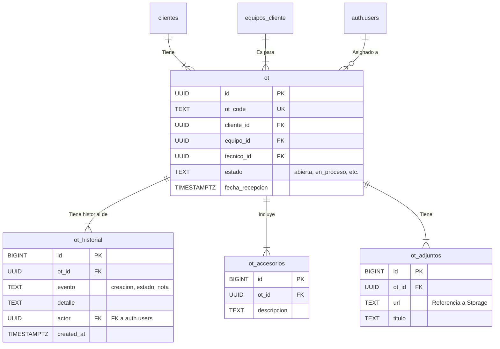

# [Sección 4] — Módulo de Órdenes de Trabajo (OT)

## 1. Resumen del Módulo

El módulo de Órdenes de Trabajo (OT) es el núcleo operativo del sistema. Centraliza toda la información y el ciclo de vida de cada servicio de reparación o mantenimiento, desde la solicitud inicial hasta la entrega final al cliente.

**Objetivo:** Proporcionar una visión clara y un control total sobre el flujo de trabajo del taller, mejorar la comunicación interna y registrar un historial detallado de cada intervención.

**Actores y Responsabilidades:**
-   **Recepcionista:** Es el punto de entrada. Abre nuevas OTs, registra la información del cliente, el equipo, la falla reportada y los accesorios entregados. Puede actualizar prioridades y asignar OTs a la cola de trabajo.
-   **Técnico:** Es el responsable de la ejecución. Toma OTs de la cola, realiza el diagnóstico, cambia los estados a `en_proceso`, `en_espera` (por repuestos) o `esperando_cliente` (por aprobación de presupuesto). Registra notas técnicas y eventos en el historial.
-   **Administrador:** Tiene la supervisión completa. Puede realizar todas las acciones de los roles anteriores, pero además es el único responsable de los estados finales críticos como `cerrada` (finaliza el ciclo de facturación) y `garantia`. También puede realizar cambios y correcciones en cualquier OT.

---

## 2. Diagrama de Entidades (Mermaid)



---

## 3. Flujo de Estados Típico de una OT

Una OT sigue un ciclo de vida definido por su campo `estado`. El flujo más común es el siguiente:

`abierta` → `en_proceso` → (`en_espera` | `esperando_cliente`) → `cerrada`

-   **Abierta:** Creada por recepción, en cola para ser asignada o tomada por un técnico.
-   **En Proceso:** Un técnico está trabajando activamente en el diagnóstico o reparación.
-   **En Espera:** El trabajo está pausado, usualmente esperando un repuesto interno.
-   **Esperando Cliente:** El trabajo está pausado, esperando la aprobación de un presupuesto o una respuesta del cliente.
-   **Cerrada:** El servicio se completó, el equipo fue entregado y el ciclo de facturación ha finalizado.
-   **Garantía:** Una OT cerrada que ha regresado por un problema relacionado con la reparación original.

---

## 4. Cómo Aplicar la Estructura

Sigue estos pasos en el **SQL Editor** de tu proyecto Supabase para desplegar el módulo completo.

1.  **Ejecutar Script del Modelo de Datos:**
    -   Copia el contenido de `supabase/sql/06_ot_modelo.sql`.
    -   Pégalo en una nueva consulta y ejecútalo. Esto creará las tablas (`ot`, `ot_historial`, etc.), funciones (`fn_next_ot_code`), triggers para el historial automático y las vistas de apoyo.

2.  **Ejecutar Script de Políticas de Seguridad (RLS):**
    -   Copia el contenido de `supabase/sql/07_rls_ot.sql` (archivo a crear).
    -   Pégalo en una nueva consulta y ejecútalo. Esto activará RLS en las tablas de OT y aplicará las políticas de acceso para cada rol, asegurando que cada usuario solo pueda realizar las acciones que le corresponden.

---

## 5. Pruebas Manuales de Políticas RLS

Ejecuta estas consultas en el **SQL Editor** para verificar que las políticas de seguridad funcionan como se espera. **Recuerda reemplazar los `<UUID_...>` por los IDs reales de tus usuarios de prueba.**

### Como `admin@local` (Acceso Total)
```sql
DO $$
DECLARE
  test_ot_id UUID;
  test_client_id UUID := (SELECT id FROM public.clientes LIMIT 1);
  test_equipo_id UUID := (SELECT id FROM public.equipos_cliente LIMIT 1);
BEGIN
  SET LOCAL ROLE authenticator;
  SET LOCAL "request.jwt.claims" TO '{"sub": "<UUID_DEL_ADMIN>", "role": "authenticated"}';

  RAISE NOTICE '✅ [Admin] Creando OT...';
  INSERT INTO public.ot (cliente_id, equipo_id, estado, diagnostico_preliminar)
  VALUES (test_client_id, test_equipo_id, 'abierta', 'Prueba admin')
  RETURNING id INTO test_ot_id;
  RAISE NOTICE 'ÉXITO: Admin creó la OT %', test_ot_id;

  RAISE NOTICE '✅ [Admin] Verificando historial automático...';
  PERFORM * FROM public.ot_historial WHERE ot_id = test_ot_id AND evento = 'creacion';
  RAISE NOTICE 'ÉXITO: Se encontró el evento de creación.';

  RAISE NOTICE '✅ [Admin] Cambiando estado a "cerrada"...';
  UPDATE public.ot SET estado = 'cerrada' WHERE id = test_ot_id;
  RAISE NOTICE 'ÉXITO: Admin cerró la OT.';

  DELETE FROM public.ot WHERE id = test_ot_id;
END $$;
```

### Como `recepcionista@local` (Permisos de Creación y Gestión Básica)
```sql
DO $$
DECLARE
  test_ot_id UUID;
  test_client_id UUID := (SELECT id FROM public.clientes LIMIT 1);
  test_equipo_id UUID := (SELECT id FROM public.equipos_cliente LIMIT 1);
BEGIN
  SET LOCAL ROLE authenticator;
  SET LOCAL "request.jwt.claims" TO '{"sub": "<UUID_DE_RECEPCIONISTA>", "role": "authenticated"}';

  RAISE NOTICE '✅ [Recep] Creando OT...';
  INSERT INTO public.ot (cliente_id, equipo_id, estado, diagnostico_preliminar)
  VALUES (test_client_id, test_equipo_id, 'abierta', 'Prueba recep')
  RETURNING id INTO test_ot_id;
  RAISE NOTICE 'ÉXITO: Recepcionista creó la OT.';

  RAISE NOTICE '✅ [Recep] Agregando accesorio...';
  INSERT INTO public.ot_accesorios (ot_id, descripcion) VALUES (test_ot_id, 'Cargador');
  RAISE NOTICE 'ÉXITO: Accesorio agregado.';
  
  RAISE NOTICE '❌ [Recep] Intentando borrar la OT... (Debe fallar)';
  DELETE FROM public.ot WHERE id = test_ot_id;

EXCEPTION
  WHEN OTHERS THEN
    RAISE NOTICE 'ÉXITO DE LA PRUEBA: El borrado falló como se esperaba. %', SQLERRM;
    DELETE FROM public.ot WHERE id = test_ot_id; -- Limpieza como admin
END $$;
```

### Como `tecnico@local` (Permisos de Operación)
```sql
DO $$
DECLARE
  test_ot_id UUID := (SELECT id FROM public.ot LIMIT 1);
BEGIN
  SET LOCAL ROLE authenticator;
  SET LOCAL "request.jwt.claims" TO '{"sub": "<UUID_DEL_TECNICO>", "role": "authenticated"}';

  RAISE NOTICE '✅ [Técnico] Viendo OTs...';
  PERFORM * FROM public.ot LIMIT 1;
  RAISE NOTICE 'ÉXITO: Técnico puede leer OTs.';

  RAISE NOTICE '✅ [Técnico] Cambiando estado a "en_proceso"...';
  UPDATE public.ot SET estado = 'en_proceso', tecnico_id = '<UUID_DEL_TECNICO>' WHERE id = test_ot_id;
  RAISE NOTICE 'ÉXITO: Técnico actualizó estado.';
  
  RAISE NOTICE '❌ [Técnico] Intentando cerrar la OT... (Debe fallar)';
  UPDATE public.ot SET estado = 'cerrada' WHERE id = test_ot_id;

EXCEPTION
  WHEN OTHERS THEN
    RAISE NOTICE 'ÉXITO DE LA PRUEBA: El cierre de la OT falló como se esperaba. %', SQLERRM;
    UPDATE public.ot SET estado = 'abierta', tecnico_id = NULL WHERE id = test_ot_id; -- Revertir
END $$;
```

---

## 6. Vistas de Apoyo y Consultas Útiles

Las vistas simplifican las consultas más comunes relacionadas con las OTs.

-   **`public.v_ot_detalle`**
    -   **Propósito:** Une la tabla `ot` con `clientes`, `equipos_cliente` y `auth.users` para obtener una vista completa y desnormalizada de cada OT. Ideal para mostrar detalles en la UI sin necesidad de hacer múltiples `JOINs`.
    -   **Consulta de Ejemplo:**
        ```sql
        -- Obtener detalles de una OT específica
        SELECT * FROM public.v_ot_detalle WHERE ot_code = 'OT-2024-000123';
        ```

-   **`public.v_ot_cola_hoy`**
    -   **Propósito:** Muestra las OTs que tienen su `turno_fecha` establecida para el día actual, ordenadas por canal, prioridad y posición. Es la vista principal para que los técnicos sepan qué trabajo sigue.
    -   **Consulta de Ejemplo:**
        ```sql
        -- Ver la cola de trabajo del día
        SELECT ot_code, cliente_nombre, equipo_serial, prioridad, turno_pos
        FROM public.v_ot_cola_hoy;
        ```

---

## 7. Checklist de Verificación de Permisos

| Rol           | Crear OT | Leer Todas OTs | Actualizar OT Propia | Cambiar Estado (Básico) | Cambiar Estado (Cerrar) | Borrar OT |
| :------------ | :------: | :------------: | :------------------: | :---------------------: | :---------------------: | :-------: |
| **Admin**     |    ✅    |       ✅       |          ✅          |            ✅           |            ✅           |     ✅    |
| **Recep.**    |    ✅    |       ✅       |          ✅          |            ✅           |            ❌           |     ❌    |
| **Técnico**   |    ❌    |       ✅       |     ✅ (asignada)    |      ✅ (asignada)      |            ❌           |     ❌    |
| **Cliente**   |    ❌    | ✅ (propias)   |          ❌          |            ❌           |            ❌           |     ❌    |

---

## 8. Tareas Pendientes (TODOs)

-   [ ] **Integración con Portal de Clientes:**
    -   Crear la sección "Mis Servicios" donde los clientes puedan ver el estado y el historial de sus OTs, basándose en la política RLS que filtra por `cliente_id`.
-   [ ] **Integración con Presupuestos y Facturación:**
    -   El módulo de OTs servirá como base para un futuro módulo de presupuestos. Un presupuesto se generará a partir de una OT.
    -   El estado `cerrada` de una OT deberá disparar o habilitar la generación de la factura correspondiente.
-   [ ] **Notificaciones Automáticas:**
    -   Implementar funciones (ej. con Supabase Edge Functions) que se disparen en cambios de estado (`esperando_cliente`, `cerrada`) para enviar notificaciones por email o WhatsApp al cliente.
