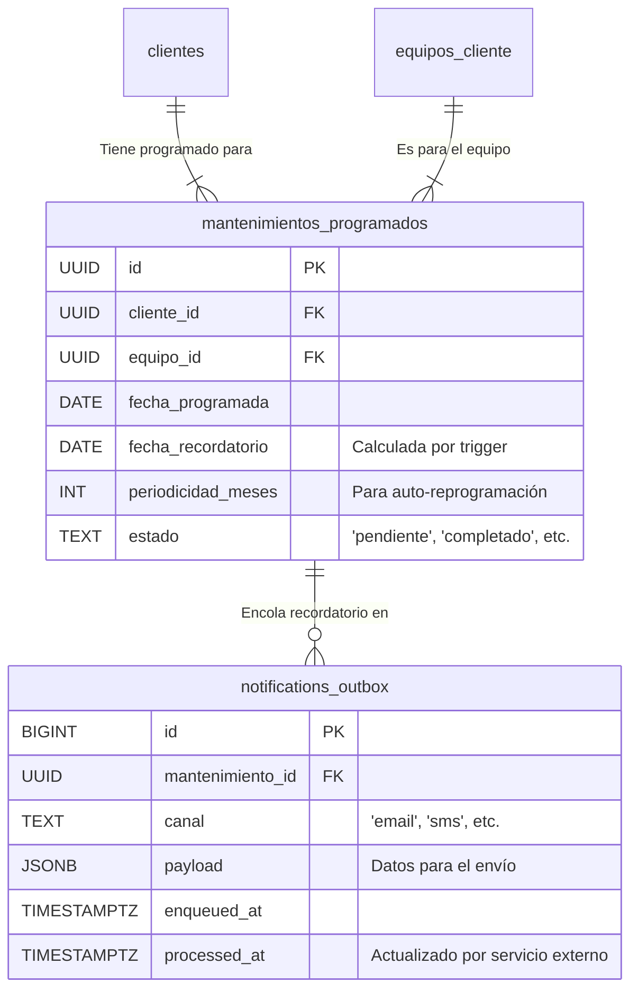

# [Sección 5] — Módulo de Mantenimientos Programados

## 1. Resumen del Módulo

Este módulo proactivo está diseñado para gestionar mantenimientos preventivos y citas programadas, mejorando la retención de clientes y generando ingresos recurrentes. Su objetivo principal es automatizar el proceso de recordar a los clientes sobre los próximos servicios para sus equipos.

**Relación con otros módulos:**
-   **Clientes y Equipos:** Cada mantenimiento está directamente vinculado a un `cliente` y a uno de sus `equipos_cliente`, asegurando un historial de servicio completo por equipo.
-   **Integración Externa:** Utiliza una tabla de "bandeja de salida" (`notifications_outbox`) que actúa como una cola de trabajo para un servicio externo (como una Supabase Edge Function o Google Cloud Function), el cual se encarga de enviar las notificaciones reales (email, SMS, etc.).

**Rol de los Recordatorios:**
El sistema calcula automáticamente una fecha de recordatorio basada en la fecha programada. Un proceso automatizado encola estas notificaciones, desacoplando la lógica de negocio de la lógica de envío, lo que permite un sistema robusto y escalable.

---

## 2. Diagrama de Entidades (Mermaid)



---

## 3. Flujo del Proceso

El ciclo de vida de un mantenimiento programado es en gran parte automatizado.

1.  **Creación:** Un `recepcionista` o `admin` crea un nuevo `mantenimiento_programado`, especificando el equipo, el cliente, el tipo de servicio y la `fecha_programada`.
2.  **Cálculo Automático:** Al insertar o actualizar el registro, el trigger `trg_set_fecha_recordatorio` se dispara y calcula automáticamente el campo `fecha_recordatorio` restando los `remind_days_before` de la `fecha_programada`.
3.  **Encolado de Recordatorios:** Un job programado (ej. Supabase Cron Job) ejecuta periódicamente la función `public.fn_enqueue_due_reminders()`. Esta función busca todos los mantenimientos cuya `fecha_recordatorio` es hoy o anterior y que aún están `pendientes`. Para cada uno, inserta un registro en la tabla `public.notifications_outbox`.
4.  **Envío Externo:** Un servicio de backend (como una Cloud Function) monitorea la tabla `notifications_outbox`. Al encontrar nuevos registros (`processed_at IS NULL`), toma el `payload` y el `canal`, envía la notificación real al cliente y, si tiene éxito, actualiza el campo `processed_at` en `notifications_outbox` para marcarlo como procesado.
5.  **Confirmación y Cierre:** El personal del taller actualiza el `estado` del mantenimiento a `confirmado` (si el cliente responde) o `completado` (una vez realizado el servicio).
6.  **Reprogramación Automática:** Si un mantenimiento tiene un valor en `periodicidad_meses` y su estado se actualiza a `completado`, el trigger `trg_mant_after_update` crea automáticamente un nuevo registro de mantenimiento para la siguiente fecha programada.

---

## 4. Cómo Aplicar la Estructura

Sigue estos pasos en el **SQL Editor** de tu proyecto Supabase para desplegar el módulo.

1.  **Ejecutar Script del Modelo de Datos:**
    -   Copia el contenido de `supabase/sql/08_mantenimientos_modelo.sql`.
    -   Pégalo en una nueva consulta y ejecútalo. Esto creará las tablas, funciones y triggers.

2.  **Ejecutar Script de Políticas de Seguridad (RLS):**
    -   Copia el contenido de `supabase/sql/09_rls_mantenimientos.sql`.
    -   Pégalo en una nueva consulta y ejecútalo. Esto activará RLS y aplicará las políticas de acceso.

---

## 5. Pruebas Manuales en Supabase SQL Editor

Ejecuta estas consultas para verificar que la lógica y los permisos funcionan como se espera.

### Prueba de Creación y Encolado
```sql
DO $$
DECLARE
  test_client_id UUID := (SELECT id FROM public.clientes LIMIT 1);
  test_equipo_id UUID := (SELECT id FROM public.equipos_cliente WHERE cliente_id = test_client_id LIMIT 1);
  new_maint_id UUID;
  enqueued_count INT;
BEGIN
  -- Simular sesión de recepcionista
  SET LOCAL ROLE authenticator;
  SET LOCAL "request.jwt.claims" TO '{"sub": "<UUID_DE_RECEPCIONISTA>", "role": "authenticated"}';

  RAISE NOTICE '✅ [Recep] Creando mantenimiento a 7 días...';
  INSERT INTO public.mantenimientos_programados(cliente_id, equipo_id, tipo, fecha_programada, remind_days_before)
  VALUES (test_client_id, test_equipo_id, 'Limpieza Preventiva', (now() + interval '7 days')::date, 7)
  RETURNING id INTO new_maint_id;
  
  -- Verificar que la fecha de recordatorio se calculó para hoy
  ASSERT (SELECT fecha_recordatorio = current_date FROM public.mantenimientos_programados WHERE id = new_maint_id), 'Fallo: La fecha de recordatorio no es hoy.';
  RAISE NOTICE 'ÉXITO: Mantenimiento creado y fecha de recordatorio calculada correctamente para hoy.';

  RAISE NOTICE '✅ [Sistema] Ejecutando encolador de recordatorios...';
  SELECT public.fn_enqueue_due_reminders() INTO enqueued_count;
  ASSERT enqueued_count > 0, 'Fallo: No se encolaron recordatorios.';
  RAISE NOTICE 'ÉXITO: Se encolaron % recordatorios.', enqueued_count;

  -- Verificar en la bandeja de salida
  ASSERT (SELECT EXISTS (SELECT 1 FROM public.notifications_outbox WHERE mantenimiento_id = new_maint_id AND processed_at IS NULL)), 'Fallo: El recordatorio no está en la bandeja de salida.';
  RAISE NOTICE 'ÉXITO: El nuevo mantenimiento está en la bandeja de salida, listo para ser enviado.';

  -- Limpieza
  DELETE FROM public.mantenimientos_programados WHERE id = new_maint_id;
END $$;
```

### Prueba de Cierre y Reprogramación
```sql
DO $$
DECLARE
  test_client_id UUID := (SELECT id FROM public.clientes LIMIT 1);
  test_equipo_id UUID := (SELECT id FROM public.equipos_cliente WHERE cliente_id = test_client_id LIMIT 1);
  completed_maint_id UUID;
BEGIN
  -- Simular sesión de admin
  SET LOCAL ROLE authenticator;
  SET LOCAL "request.jwt.claims" TO '{"sub": "<UUID_DEL_ADMIN>", "role": "authenticated"}';

  -- Crear un mantenimiento de prueba con periodicidad
  INSERT INTO public.mantenimientos_programados(cliente_id, equipo_id, tipo, fecha_programada, periodicidad_meses)
  VALUES (test_client_id, test_equipo_id, 'Cambio Insumos', now()::date, 6)
  RETURNING id INTO completed_maint_id;

  RAISE NOTICE '✅ [Admin] Marcando mantenimiento como "completado"...';
  UPDATE public.mantenimientos_programados SET estado = 'completado' WHERE id = completed_maint_id;
  
  -- Verificar que se creó el siguiente mantenimiento
  ASSERT (SELECT EXISTS (
    SELECT 1 FROM public.mantenimientos_programados 
    WHERE equipo_id = test_equipo_id 
      AND estado = 'pendiente' 
      AND fecha_programada > now()::date
  )), 'Fallo: No se creó el siguiente mantenimiento automático.';
  RAISE NOTICE 'ÉXITO: El siguiente mantenimiento fue reprogramado automáticamente.';

  -- Limpieza
  DELETE FROM public.mantenimientos_programados WHERE equipo_id = test_equipo_id;
END $$;
```

---

## 6. Checklist de Verificación de Permisos

| Rol           | Crear Mantenimiento | Leer Mantenimientos | Actualizar Estado | Completar Mantenimiento | Eliminar |
| :------------ | :-----------------: | :-----------------: | :---------------: | :---------------------: | :------: |
| **Admin**     |          ✅         |          ✅         |         ✅        |            ✅           |    ✅    |
| **Recep.**    |          ✅         |          ✅         |         ✅        |            ❌           |    ❌    |
| **Técnico**   |         ❌          |          ✅         |  ✅ (limitado)    |            ❌           |    ❌    |
| **Cliente**   |         ❌          |    ✅ (propio)      |         ❌        |            ❌           |    ❌    |

---

## 7. Guía de Integración para el Servicio de Notificaciones

El envío real de notificaciones debe ser manejado por un proceso de backend seguro.

1.  **Configuración del Servicio (ej. Supabase Edge Function):**
    -   Crea una nueva función que se ejecute en un cronograma (ej. cada 5 minutos).
    -   Utiliza el `service_role` key de Supabase para inicializar el cliente de Supabase dentro de la función. Esto es **crucial** para que la función pueda leer y escribir en `notifications_outbox` sin ser bloqueada por RLS.

2.  **Lógica de la Función:**
    -   **Polling:** La función debe consultar `public.notifications_outbox` para obtener registros donde `processed_at IS NULL`.
    -   **Procesamiento:** Por cada registro, utiliza el `canal` y el `payload` para construir y enviar la notificación (ej. usando un servicio como SendGrid para email, Twilio para SMS, etc.).
    -   **Actualización:** Si el envío es exitoso, la función **debe** ejecutar un `UPDATE` en `notifications_outbox` para establecer el campo `processed_at = now()` para ese registro, evitando que se envíe de nuevo.
    -   **Manejo de Errores:** Implementa lógica para manejar fallos en el envío (reintentos, registro de errores, etc.).

---

## 8. Tareas Pendientes (TODOs)

-   [ ] **Integración con Portal de Clientes:**
    -   Permitir a los clientes ver sus mantenimientos programados.
    -   Añadir botones para que los clientes puedan confirmar o solicitar la reprogramación de una cita directamente desde el portal.
-   [ ] **Integración con Órdenes de Trabajo (OT):**
    -   Crear un flujo para que, a partir de un mantenimiento `confirmado`, se pueda generar una OT pre-llenada con los datos del cliente y el equipo, agilizando el ingreso al taller.
-   [ ] **Notificaciones Push:**
    -   Ampliar el sistema para soportar el canal `push`, permitiendo enviar notificaciones directamente a la PWA o aplicación móvil del cliente.