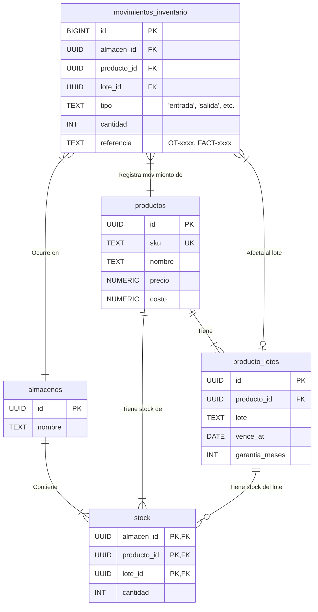

# [Sección 6] — Módulo de Inventario

## 1. Resumen del Módulo

Este módulo implementa un sistema de inventario robusto y normalizado, diseñado para gestionar productos, repuestos y servicios. Va más allá de un simple conteo de stock, incorporando la gestión de múltiples almacenes, el control de lotes para trazabilidad (fechas de vencimiento, garantías) y un historial completo de movimientos (Kardex).

**Relación con otros módulos:**
-   **Órdenes de Trabajo (OT):** Es el principal consumidor de repuestos. Cuando un técnico utiliza un componente en una reparación, se genera un movimiento de `salida` del inventario, asociándolo a la OT correspondiente.
-   **Punto de Venta (POS) (Futuro):** Las ventas directas a clientes generarán movimientos de `salida`, afectando el stock en tiempo real y vinculándose a una factura.
-   **Contabilidad:** Las entradas de inventario por compra y los ajustes por pérdida se reflejan como egresos en el módulo de contabilidad, proporcionando una visión del Costo de Mercancía Vendida (CMV).

---

## 2. Diagrama de Entidades (Mermaid)



---

## 3. Flujos de Inventario y Reglas de Negocio

La tabla `stock` nunca se modifica directamente. Todos los cambios son el resultado de insertar un registro en `movimientos_inventario`, lo que garantiza una auditoría completa. Un trigger se encarga de aplicar la lógica.

**Flujos Principales:**
-   **Entrada de Compra:** Un `recepcionista` o `admin` registra un movimiento de tipo `entrada` al recibir mercancía de un proveedor. El trigger incrementa la cantidad en la tabla `stock`.
-   **Salida a OT:** Un `técnico` registra un movimiento de tipo `salida`, especificando la `referencia` (ej. 'OT-2024-00123'). El trigger valida que haya stock suficiente y que el lote no esté vencido, y luego decrementa la cantidad en `stock`.
-   **Devolución de Venta:** Un `recepcionista` registra una `devolucion_venta`. El producto reingresa al inventario, incrementando el `stock`.
-   **Garantía (RMA):**
    -   `garantia_salida`: Un `técnico` o `admin` registra la salida de un producto defectuoso hacia el proveedor para su garantía. Esto decrementa el `stock`.
    -   `garantia_reingreso`: Un `admin` registra el reingreso del producto (reparado o nuevo) desde el proveedor. Esto incrementa el `stock`.
-   **Ajuste:** Exclusivo para `admin`. Se utiliza para corregir discrepancias después de un conteo físico. Este tipo de movimiento no afecta el stock vía trigger (`fn_mov_to_delta` devuelve 0), requiriendo una acción manual o una función específica de ajuste si fuera necesario para reconciliar.

**Reglas de Negocio Clave:**
-   **Stock no Negativo:** El trigger previene cualquier movimiento de salida que resulte en una cantidad de stock menor a cero.
-   **Bloqueo por Lote Vencido:** El trigger impide registrar salidas de productos cuyo `lote` asociado tiene una `vence_at` que ya pasó.
-   **Alerta de Vencimientos Próximos:** La vista `public.v_lotes_por_vencer` proporciona una lista de todos los lotes que vencerán en los próximos 30 días, permitiendo una gestión proactiva.

---

## 4. Cómo Aplicar la Estructura

Sigue estos pasos en el **SQL Editor** de tu proyecto Supabase.

1.  **Ejecutar Script del Modelo de Datos:**
    -   Copia el contenido de `supabase/sql/10_inventario_modelo.sql`.
    -   Pégalo en una nueva consulta y ejecútalo.

2.  **Ejecutar Script de Políticas de Seguridad (RLS):**
    -   Copia el contenido de `supabase/sql/11_rls_inventario.sql`.
    -   Pégalo en una nueva consulta y ejecútalo.

---

## 5. Pruebas Manuales de Políticas RLS

Ejecuta estas consultas para verificar que los permisos de cada rol funcionan correctamente. **Recuerda reemplazar los `<UUID_...>` por los IDs reales.**

### Como `recepcionista@local` (Puede registrar entradas)
```sql
DO $$
DECLARE
  test_almacen_id UUID := (SELECT id FROM public.almacenes LIMIT 1);
  test_producto_id UUID := (SELECT id FROM public.productos WHERE sku = 'SSD-KNG-240');
  stock_inicial INT;
BEGIN
  SET LOCAL ROLE authenticator;
  SET LOCAL "request.jwt.claims" TO '{"sub": "<UUID_DE_RECEPCIONISTA>", "role": "authenticated"}';
  
  SELECT cantidad INTO stock_inicial FROM public.stock WHERE producto_id = test_producto_id AND almacen_id = test_almacen_id;
  RAISE NOTICE '✅ [Recep] Stock inicial: %', stock_inicial;

  RAISE NOTICE 'Intentando registrar una entrada...';
  INSERT INTO public.movimientos_inventario (almacen_id, producto_id, tipo, cantidad, referencia)
  VALUES (test_almacen_id, test_producto_id, 'entrada', 5, 'COMPRA-PROV-XYZ');
  
  ASSERT (SELECT cantidad FROM public.stock WHERE producto_id = test_producto_id) = stock_inicial + 5, 'Fallo: El stock no se incrementó.';
  RAISE NOTICE 'ÉXITO: Recepcionista registró una entrada y el stock se actualizó a %.', stock_inicial + 5;

  -- Limpieza (como admin)
  SET LOCAL "request.jwt.claims" TO '{"sub": "<UUID_DEL_ADMIN>", "role": "authenticated"}';
  INSERT INTO public.movimientos_inventario (almacen_id, producto_id, tipo, cantidad)
  VALUES (test_almacen_id, test_producto_id, 'salida', 5);
END $$;
```

### Como `tecnico@local` (Puede registrar salidas para OTs)
```sql
DO $$
DECLARE
  test_almacen_id UUID := (SELECT id FROM public.almacenes LIMIT 1);
  test_producto_id UUID := (SELECT id FROM public.productos WHERE sku = 'SSD-KNG-240');
  stock_inicial INT;
BEGIN
  SET LOCAL ROLE authenticator;
  SET LOCAL "request.jwt.claims" TO '{"sub": "<UUID_DEL_TECNICO>", "role": "authenticated"}';

  SELECT cantidad INTO stock_inicial FROM public.stock WHERE producto_id = test_producto_id;
  RAISE NOTICE '✅ [Técnico] Stock inicial: %', stock_inicial;

  RAISE NOTICE 'Intentando registrar una salida para una OT...';
  INSERT INTO public.movimientos_inventario (almacen_id, producto_id, tipo, cantidad, referencia)
  VALUES (test_almacen_id, test_producto_id, 'salida', 1, 'OT-2024-00123');

  ASSERT (SELECT cantidad FROM public.stock WHERE producto_id = test_producto_id) = stock_inicial - 1, 'Fallo: El stock no disminuyó.';
  RAISE NOTICE 'ÉXITO: Técnico registró una salida y el stock se actualizó a %.', stock_inicial - 1;

  RAISE NOTICE '❌ [Técnico] Intentando registrar una entrada... (Debe fallar)';
  INSERT INTO public.movimientos_inventario (almacen_id, producto_id, tipo, cantidad)
  VALUES (test_almacen_id, test_producto_id, 'entrada', 1);

EXCEPTION WHEN OTHERS THEN
  RAISE NOTICE 'ÉXITO DE LA PRUEBA: La inserción de entrada falló como se esperaba. %', SQLERRM;
  SET LOCAL "request.jwt.claims" TO '{"sub": "<UUID_DEL_ADMIN>", "role": "authenticated"}';
  INSERT INTO public.movimientos_inventario (almacen_id, producto_id, tipo, cantidad)
  VALUES (test_almacen_id, test_producto_id, 'entrada', 1); -- Revertir
END $$;
```

---

## 6. Checklist de Verificación de Permisos de Movimientos

| Rol           | `entrada` | `devolucion_venta` | `salida` (con OT) | `garantia_salida` (con OT) | `ajuste` | Otros (`devolucion_compra`, etc.) |
| :------------ | :-------: | :----------------: | :---------------: | :------------------------: | :------: | :-------------------------------: |
| **Admin**     |     ✅    |         ✅         |         ✅        |             ✅             |    ✅    |                 ✅                |
| **Recep.**    |     ✅    |         ✅         |         ❌        |             ❌             |    ❌    |                 ❌                |
| **Técnico**   |     ❌    |         ❌         |         ✅        |             ✅             |    ❌    |                 ❌                |

---

## 7. Tareas Pendientes (TODOs) de Integración

-   [ ] **Integración con Punto de Venta (POS):**
    -   El sistema POS deberá generar un movimiento de tipo `salida` por cada producto vendido, con una `referencia` al número de factura (ej. 'FACT-00123').
-   [ ] **Integración con Órdenes de Trabajo (OT):**
    -   Desde la interfaz de una OT, el técnico debería poder seleccionar un repuesto del inventario. Esta acción debe crear automáticamente el movimiento de `salida` con la `referencia` correcta de la OT, descontando el stock y añadiendo el costo al presupuesto de la OT.
-   [ ] **Alertas de Vencimiento y Stock Bajo:**
    -   Conectar la vista `v_lotes_por_vencer` y los productos con `cantidad <= minStockLevel` al módulo de notificaciones (Sección 5) para enviar alertas automáticas al personal de compras o al administrador.