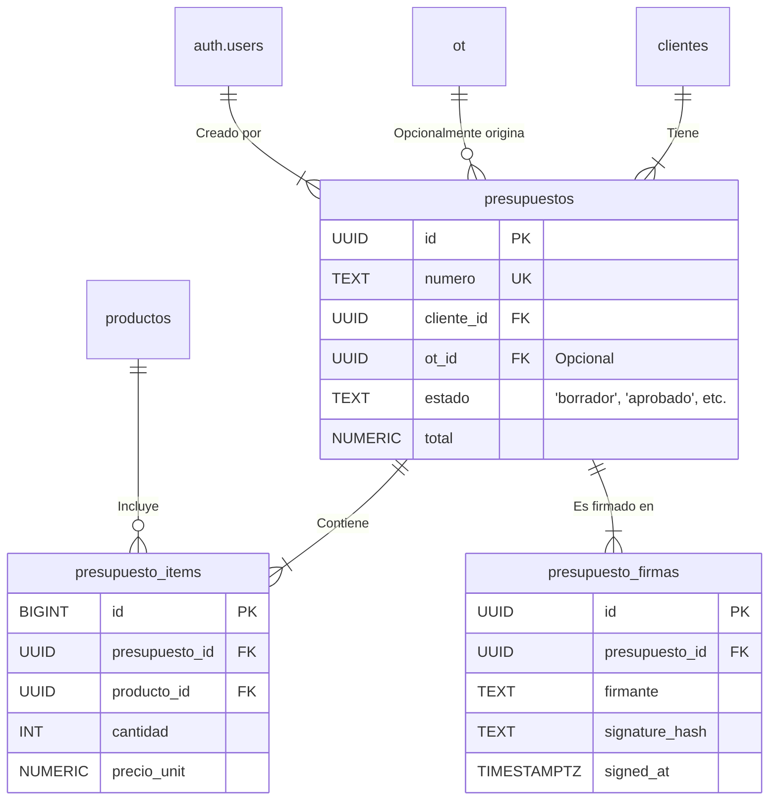

# [Sección 8] — Módulo de Presupuestos y su Vínculo con OT

## 1. Resumen del Módulo

Este módulo formaliza el proceso de cotización de servicios, actuando como un puente entre el diagnóstico técnico de una Orden de Trabajo (OT) y la facturación final en el Punto de Venta (POS). Permite crear, enviar y gestionar presupuestos detallados para la aprobación del cliente antes de proceder con una reparación costosa.

**Flujo de Responsabilidades:**
1.  **Diagnóstico (Técnico):** Un técnico examina el equipo asociado a una OT y registra sus hallazgos y la solución propuesta en el campo `diagnostico` de la OT o directamente en el presupuesto.
2.  **Armado del Presupuesto (Recepcionista/Admin):** Utilizando el diagnóstico, el personal de recepción o un administrador crea un `presupuesto` en estado `borrador`. Se añaden los ítems necesarios (repuestos desde el inventario y servicios de mano de obra) con sus costos.
3.  **Envío y Aprobación (Cliente):** Una vez finalizado, el presupuesto se marca como `enviado`. El cliente recibe una notificación (idealmente a través de un enlace seguro) para revisar los detalles. El cliente aprueba el presupuesto mediante una firma digital simple, que queda registrada en `presupuesto_firmas`.
4.  **Conversión y Ejecución:** La firma del cliente (o una aprobación manual del personal) cambia el estado a `aprobado`. A partir de aquí, el presupuesto puede ser convertido en una venta formal a través de la función `fn_convert_presupuesto_to_venta`, dejando el presupuesto en estado `convertido` y creando una nueva venta en el POS para su posterior facturación.

---

## 2. Diagrama de Entidades (Mermaid)



---

## 3. Flujo del Proceso

El ciclo de vida de un presupuesto sigue un flujo de estados claro:

`borrador` → `enviado` → `aprobado` → `convertido`

-   **Borrador:** El estado inicial. El recepcionista puede añadir, modificar y eliminar ítems libremente. Los totales se recalculan automáticamente.
-   **Enviado:** El presupuesto se considera finalizado y ha sido enviado al cliente. Aún se permiten ediciones menores por parte del personal, pero idealmente ya no debería cambiar.
-   **Aprobado:** El cliente ha dado su consentimiento (ej. a través de una firma). En este punto, el presupuesto y sus ítems quedan bloqueados para la edición por parte de roles no administrativos, gracias a las políticas RLS.
-   **Rechazado/Vencido:** Estados alternativos si el cliente no aprueba o si la oferta expira.
-   **Convertido:** Estado final. El presupuesto aprobado ha sido procesado por la función `fn_convert_presupuesto_to_venta`, generando una nueva `venta` en el módulo POS. Esto previene que un mismo presupuesto sea facturado múltiples veces.

---

## 4. Cómo Aplicar la Estructura

Sigue estos pasos en el **SQL Editor** de tu proyecto Supabase.

1.  **Ejecutar Script del Modelo de Datos:**
    -   Copia el contenido de `supabase/sql/14_presupuestos_modelo.sql`.
    -   Pégalo en una nueva consulta y ejecútalo. Esto creará las tablas, secuencias, funciones de cálculo y triggers.

2.  **Ejecutar Script de Políticas de Seguridad (RLS):**
    -   Copia el contenido de `supabase/sql/15_rls_presupuestos.sql`.
    -   Pégalo en una nueva consulta y ejecútalo. Esto activará RLS en las tablas del módulo y aplicará las políticas de acceso para cada rol.

---

## 5. Pruebas Manuales de Políticas RLS

Ejecuta estas consultas para verificar que la lógica y los permisos funcionan como se espera. **Recuerda reemplazar los `<UUID_...>` por los IDs reales.**

### Como `recepcionista@local` (Creación y Envío)
```sql
DO $$
DECLARE
  test_client_id UUID := (SELECT id FROM public.clientes LIMIT 1);
  test_producto_id UUID := (SELECT id FROM public.productos WHERE sku = 'SSD-KNG-240');
  new_presupuesto_id UUID;
BEGIN
  SET LOCAL ROLE authenticator;
  SET LOCAL "request.jwt.claims" TO '{"sub": "<UUID_DE_RECEPCIONISTA>", "role": "authenticated"}';

  RAISE NOTICE '✅ [Recep] Creando presupuesto en borrador...';
  INSERT INTO public.presupuestos(cliente_id, diagnostico, creada_por)
  VALUES (test_client_id, 'Diagnóstico inicial...', auth.uid()) RETURNING id INTO new_presupuesto_id;
  RAISE NOTICE 'ÉXITO: Presupuesto % creado.', new_presupuesto_id;

  RAISE NOTICE '✅ [Recep] Agregando ítems...';
  INSERT INTO public.presupuesto_items(presupuesto_id, producto_id, cantidad, precio_unit, iva_pct)
  VALUES (new_presupuesto_id, test_producto_id, 1, 150000, 19);
  INSERT INTO public.presupuesto_items(presupuesto_id, producto_id, cantidad, precio_unit, iva_pct)
  VALUES (new_presupuesto_id, (SELECT id FROM public.productos WHERE sku = 'SERV-CLEAN-PC'), 1, 70000, 19);
  RAISE NOTICE 'ÉXITO: Ítems agregados. El total debería haberse calculado automáticamente.';

  RAISE NOTICE '✅ [Recep] Cambiando estado a "enviado"...';
  UPDATE public.presupuestos SET estado = 'enviado' WHERE id = new_presupuesto_id;
  RAISE NOTICE 'ÉXITO: Presupuesto enviado.';
  
  RAISE NOTICE '✅ [Recep] Editando un ítem con estado "enviado"...';
  UPDATE public.presupuesto_items SET cantidad = 2 WHERE presupuesto_id = new_presupuesto_id AND producto_id = test_producto_id;
  RAISE NOTICE 'ÉXITO: Edición permitida por política RLS.';
  
  -- Limpieza
  SET LOCAL "request.jwt.claims" TO '{"sub": "<UUID_DEL_ADMIN>", "role": "authenticated"}';
  DELETE FROM public.presupuestos WHERE id = new_presupuesto_id;
END $$;
```

### Como `tecnico@local` (Actualización de Diagnóstico)
```sql
DO $$
DECLARE
  test_presupuesto_id UUID := (SELECT id FROM public.presupuestos LIMIT 1);
BEGIN
  SET LOCAL ROLE authenticator;
  SET LOCAL "request.jwt.claims" TO '{"sub": "<UUID_DEL_TECNICO>", "role": "authenticated"}';

  RAISE NOTICE '✅ [Técnico] Intentando actualizar diagnóstico...';
  UPDATE public.presupuestos SET diagnostico = 'Diagnóstico técnico finalizado.' WHERE id = test_presupuesto_id;
  RAISE NOTICE 'ÉXITO: Diagnóstico actualizado.';

  RAISE NOTICE '❌ [Técnico] Intentando cambiar estado... (Debe fallar)';
  UPDATE public.presupuestos SET estado = 'aprobado' WHERE id = test_presupuesto_id;

EXCEPTION WHEN OTHERS THEN
  RAISE NOTICE 'ÉXITO DE LA PRUEBA: El cambio de estado falló como se esperaba. %', SQLERRM;
END $$;
```

### Flujo de Aprobación y Conversión (Simulado)
```sql
DO $$
DECLARE
  -- Crear un presupuesto en estado 'enviado' para la prueba
  test_client_id UUID := (SELECT id FROM public.clientes LIMIT 1);
  test_presupuesto_id UUID;
  test_venta_id UUID;
BEGIN
  -- Crear el presupuesto como admin para la prueba
  INSERT INTO public.presupuestos(cliente_id, estado, creada_por)
  VALUES (test_client_id, 'enviado', auth.uid()) RETURNING id INTO test_presupuesto_id;

  RAISE NOTICE '✅ [Cliente/Sistema] Simular firma del cliente...';
  -- Cualquier usuario autenticado puede firmar un presupuesto 'enviado'
  SET LOCAL ROLE authenticator;
  SET LOCAL "request.jwt.claims" TO '{"sub": "<UUID_DE_UN_CLIENTE_O_SISTEMA>", "role": "authenticated"}';
  INSERT INTO public.presupuesto_firmas(presupuesto_id, firmante, role_firmante, signature_hash)
  VALUES (test_presupuesto_id, 'cliente@ejemplo.com', 'cliente', 'dummy_hash_base64');
  RAISE NOTICE 'ÉXITO: Firma registrada.';

  -- Volver a ser admin/recepcionista para aprobar y convertir
  SET LOCAL "request.jwt.claims" TO '{"sub": "<UUID_DEL_ADMIN>", "role": "authenticated"}';

  RAISE NOTICE '✅ [Admin] Cambiando estado a "aprobado" post-firma...';
  UPDATE public.presupuestos SET estado = 'aprobado' WHERE id = test_presupuesto_id;
  RAISE NOTICE 'ÉXITO: Estado actualizado a aprobado.';
  
  RAISE NOTICE '✅ [Admin] Intentando editar ítem en estado "aprobado"... (Debe fallar para no-admin)';
  -- Esta prueba fallaría si se ejecuta como recepcionista. Funciona como admin.
  
  RAISE NOTICE '✅ [Admin] Convirtiendo presupuesto a venta...';
  SELECT public.fn_convert_presupuesto_to_venta(test_presupuesto_id) INTO test_venta_id;
  ASSERT test_venta_id IS NOT NULL, 'Fallo: La conversión no devolvió un ID de venta.';
  RAISE NOTICE 'ÉXITO: Venta % creada desde el presupuesto.', test_venta_id;
  
  ASSERT (SELECT estado FROM public.presupuestos WHERE id = test_presupuesto_id) = 'convertido', 'Fallo: El estado no cambió a "convertido".';
  RAISE NOTICE 'ÉXITO: El estado del presupuesto es ahora "convertido".';

  -- Limpieza
  DELETE FROM public.presupuestos WHERE id = test_presupuesto_id;
  DELETE FROM public.ventas WHERE id = test_venta_id;
END $$;
```

---

## 6. Checklist de Verificación de Permisos

| Rol           | Crear Presupuesto | Leer Presupuestos | Modificar Ítems (`borrador`) | Modificar Ítems (`aprobado`) | Cambiar Estado | Firmar | Convertir a Venta |
| :------------ | :---------------: | :---------------: | :--------------------------: | :--------------------------: | :------------: | :----: | :---------------: |
| **Admin**     |         ✅        |         ✅        |              ✅              |              ✅              |       ✅       |   ✅   |         ✅        |
| **Recep.**    |         ✅        |         ✅        |              ✅              |              ❌              | ✅ (limitado)  |   ❌   |         ✅        |
| **Técnico**   |         ❌        |         ✅        |              ❌              |              ❌              |       ❌       |   ❌   |         ❌        |
| **Cliente**   |         ❌        |   ✅ (propio)     |              ❌              |              ❌              |       ❌       |   ✅   |         ❌        |

---

## 7. Tareas Pendientes (TODOs)

-   [ ] **Aprobación Automática:** Crear un trigger en `presupuesto_firmas` que cambie automáticamente el estado del `presupuesto` a `aprobado` cuando se inserta una firma de un `role_firmante = 'cliente'`.
-   [ ] **Enlace Seguro de Aprobación:** Desarrollar una Edge Function que genere un token de acceso temporal (JWT con `expires_in`) para un presupuesto específico. Este token se incluiría en un enlace enviado al cliente, permitiéndole ver y firmar el presupuesto sin necesidad de iniciar sesión en el portal.
-   [ ] **Plantillas de Impresión:** Crear plantillas HTML/PDF para generar versiones imprimibles y profesionales de:
    -   La Orden de Trabajo.
    -   El Presupuesto detallado.
    -   La Factura de Venta final.
-   [ ] **Auditoría Avanzada:** Ampliar la tabla de historial de la OT (`ot_historial`) para registrar también los eventos clave del presupuesto asociado (creación, envío, aprobación, conversión), creando una línea de tiempo unificada del servicio completo.
