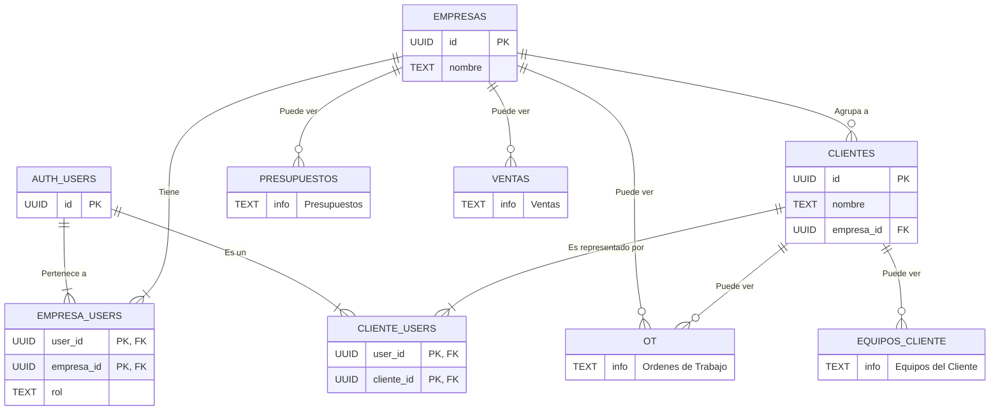

# [Sección 10] — Módulo del Portal de Cliente y Empresa

## 1. Resumen del Portal Cliente y Empresa

Este módulo extiende el sistema para ofrecer una experiencia de autoservicio a los usuarios finales, diferenciando entre clientes individuales y clientes empresariales (que pueden agrupar a múltiples clientes individuales).

**Objetivos y Alcance:**
-   **Portal del Cliente:** Proporcionar a los clientes individuales un acceso seguro para consultar el estado de sus Órdenes de Trabajo (OT), ver el historial de sus equipos, revisar presupuestos y gestionar sus datos de contacto y preferencias de notificación.
-   **Portal de Empresa:** Ofrecer a los usuarios de una empresa una vista consolidada de todos los clientes, equipos y OTs que pertenecen a su organización. Introduce un rol de `admin_empresa` que puede gestionar los usuarios vinculados a su propia empresa.
-   **Acceso Seguro sin Login:** Implementa un sistema de tokens de un solo uso (`portal_tokens`) para permitir acciones seguras (como ver o firmar un presupuesto) a través de un enlace, sin necesidad de que el cliente inicie sesión.

La arquitectura de seguridad se basa en dos tablas de unión clave: `cliente_users` (para vincular un `auth.users` a un `clientes`) y `empresa_users` (para vincular un `auth.users` a una `empresas`). Esto, combinado con RLS, asegura que cada usuario solo vea la información que le corresponde.

---

## 2. Diagrama de Entidades (Mermaid)



---

## 3. Cómo Aplicar la Estructura

Sigue estos pasos en el **SQL Editor** de tu proyecto Supabase para desplegar el módulo completo.

1.  **Ejecutar Script del Modelo de Datos:**
    -   Copia el contenido de `supabase/sql/17_portal_modelo.sql`.
    -   Pégalo en una nueva consulta y ejecútalo. Esto creará las tablas (`empresas`, `cliente_users`, `portal_tokens`, etc.), las funciones para gestionar tokens y la vista de identidad `v_portal_identity`.

2.  **Ejecutar Script de Políticas de Seguridad (RLS):**
    -   Copia el contenido de `supabase/sql/18_rls_portal.sql`.
    -   Pégalo en una nueva consulta y ejecútalo. Esto activará RLS en todas las tablas relevantes y aplicará las políticas que restringen el acceso a los datos según el vínculo del usuario con un cliente o una empresa.

---

## 4. Pruebas Manuales de Políticas RLS

Antes de ejecutar, asegúrate de tener:
-   Un usuario de prueba en `auth.users`.
-   Un registro de `clientes` y otro de `empresas`.
-   Un vínculo en `cliente_users` entre el usuario y el cliente.
-   Un vínculo en `empresa_users` entre otro usuario y la empresa.
-   Algunas OTs y equipos asociados a los clientes de prueba.

**Recuerda reemplazar los `<UUID_...>` por los IDs reales.**

### Como Usuario Cliente Individual
```sql
DO $$
DECLARE
  -- UUID del usuario vinculado en cliente_users
  test_user_id UUID := '<UUID_DEL_USUARIO_CLIENTE>';
  -- UUID del cliente al que está vinculado
  test_client_id UUID := '<UUID_DEL_CLIENTE_ASOCIADO>';
  record_count INT;
BEGIN
  -- Simular sesión del cliente
  SET LOCAL ROLE authenticator;
  SET LOCAL "request.jwt.claims" TO jsonb_build_object('sub', test_user_id::text, 'role', 'authenticated');

  RAISE NOTICE '✅ [Cliente] Intentando leer sus propias OTs...';
  SELECT count(*) INTO record_count FROM public.ot WHERE cliente_id = test_client_id;
  ASSERT record_count > 0, 'Fallo: El cliente no pudo ver sus propias OTs.';
  RAISE NOTICE 'ÉXITO: Cliente puede ver sus % OTs.', record_count;

  RAISE NOTICE '❌ [Cliente] Intentando leer OTs de OTRO cliente... (Debe devolver 0 filas)';
  SELECT count(*) INTO record_count FROM public.ot WHERE cliente_id != test_client_id;
  ASSERT record_count = 0, 'Fallo: El cliente vio OTs que no le pertenecen.';
  RAISE NOTICE 'ÉXITO: Cliente no puede ver OTs de otros (obtuvo % filas).', record_count;
END $$;
```

### Como Usuario de Empresa
```sql
DO $$
DECLARE
  -- UUID del usuario vinculado en empresa_users
  test_user_id UUID := '<UUID_DEL_USUARIO_EMPRESA>';
  -- UUID de la empresa a la que está vinculado
  test_company_id UUID := '<UUID_DE_LA_EMPRESA_ASOCIADA>';
  record_count INT;
BEGIN
  -- Simular sesión del usuario de empresa
  SET LOCAL ROLE authenticator;
  SET LOCAL "request.jwt.claims" TO jsonb_build_object('sub', test_user_id::text, 'role', 'authenticated');

  RAISE NOTICE '✅ [Empresa] Intentando leer los clientes de su empresa...';
  -- NOTA: Asegúrate de tener clientes con el empresa_id correcto
  SELECT count(*) INTO record_count FROM public.clientes WHERE empresa_id = test_company_id;
  ASSERT record_count > 0, 'Fallo: El usuario no pudo ver los clientes de su empresa.';
  RAISE NOTICE 'ÉXITO: Usuario puede ver los % clientes de su empresa.', record_count;

  RAISE NOTICE '❌ [Empresa] Intentando leer clientes de OTRA empresa... (Debe devolver 0 filas)';
  SELECT count(*) INTO record_count FROM public.clientes WHERE empresa_id != test_company_id;
  ASSERT record_count = 0, 'Fallo: El usuario vio clientes que no le pertenecen.';
  RAISE NOTICE 'ÉXITO: Usuario no puede ver clientes de otra empresa (obtuvo % filas).', record_count;
END $$;
```

### Emisión y Verificación de Tokens
```sql
-- Ejecutar como un rol con permisos (ej. recepcionista o admin)
SELECT public.fn_issue_portal_token(
  _kind => 'presupuesto_view',
  _ref => '<UUID_DE_UN_PRESUPUESTO>',
  _ttl_minutes => 60 -- Válido por 1 hora
);

-- Verificar que el token se creó en la tabla
SELECT token, expires_at, use_count, max_uses FROM public.portal_tokens
ORDER BY created_at DESC LIMIT 1;
-- Resultado esperado: un token, una fecha de expiración en 1 hora, use_count=0, max_uses=1.
```

---

## 5. Checklist de Verificación de Permisos

| Escenario de Usuario             | Ver sus datos (OTs, Equipos) | Ver datos de OTROS clientes | Ver datos de SU empresa | Gestionar usuarios de SU empresa | Ver datos de OTRA empresa |
| :------------------------------- | :--------------------------: | :-------------------------: | :---------------------: | :------------------------------: | :-----------------------: |
| **Cliente Individual**           |              ✅              |              ❌             |           N/A           |               N/A                |            N/A            |
| **Usuario de Empresa (rol `empresa`)** |             N/A              |              ❌             |            ✅           |                ❌                |             ❌            |
| **Admin de Empresa (rol `admin_empresa`)** | N/A | ❌ | ✅ | ✅ | ❌ |
| **Admin del Sistema**            |              ✅              |              ✅             |            ✅           |                ✅                |             ✅            |

---

## 6. Tareas Pendientes (TODOs) de Integración

-   [ ] **API para Consumo de Tokens:**
    -   Crear una Supabase Edge Function pública que reciba un token.
    -   La función llamará a `fn_consume_portal_token` para validar el token.
    -   Si es válido, devolverá los datos del recurso asociado (ej. los detalles de un presupuesto) o registrará una acción (ej. insertar una firma en `presupuesto_firmas`).

-   [ ] **Interfaz de Usuario (UI) del Portal:**
    -   Conectar los componentes ya creados en `src/pages/clientportal/` para que consuman los datos de Supabase. Las políticas RLS se encargarán de filtrar automáticamente la información correcta para el usuario que ha iniciado sesión.
    -   Implementar la página de "Aprobación de Presupuesto" que utilice los enlaces seguros generados con tokens.

-   [ ] **Notificaciones Reales (Cloud Functions):**
    -   Desarrollar un servicio de backend (ej. Cloud Function) que se active ante eventos en la base de datos (como un cambio de estado en una OT).
    -   Esta función debe leer la tabla `portal_notification_prefs` del usuario correspondiente para determinar el canal (email, SMS, etc.) y enviar la notificación real.
