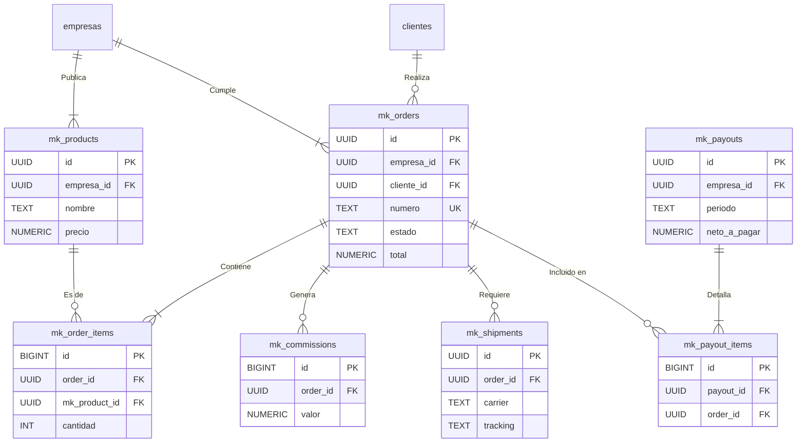

# [Sección 11] — Módulo de Marketplace

## 1. Resumen del Módulo

Este módulo transforma el sistema en una plataforma multi-vendedor, permitiendo a empresas asociadas (`empresas`) publicar sus propios productos y gestionar las ventas generadas a través del portal. El flujo está diseñado para automatizar la gestión de pedidos, el cálculo de comisiones y la liquidación de pagos a los socios.

**Flujo del Proceso:**
1.  **Publicación:** Una empresa socia crea una publicación (`mk_products`) en el catálogo público.
2.  **Pedido:** Un cliente final realiza un pedido (`mk_orders`) de uno o más productos de un socio.
3.  **Gestión y Envío:** La empresa socia recibe la notificación del pedido, lo procesa, y gestiona el envío (`mk_shipments`), actualizando el estado del pedido a `enviada` y `entregada`.
4.  **Comisión:** Una vez que el pedido se marca como `pagada` o `entregada`, se genera un registro de comisión (`mk_commissions`) para la plataforma, basado en reglas predefinidas.
5.  **Liquidación (Payout):** Periódicamente (ej. mensualmente), el sistema agrupa todas las ventas y comisiones de un socio en una liquidación (`mk_payouts`), calculando el monto neto a pagarle.

---

## 2. Diagrama de Entidades (Mermaid)



---

## 3. Cómo Aplicar la Estructura

Sigue estos pasos en el **SQL Editor** de tu proyecto Supabase para desplegar el módulo.

1.  **Ejecutar Script del Modelo de Datos:**
    -   Copia el contenido de `supabase/sql/19_marketplace_modelo.sql`.
    -   Pégalo en una nueva consulta y ejecútalo. Esto creará todas las tablas (`mk_*`), funciones, secuencias y triggers necesarios.

2.  **Ejecutar Script de Políticas de Seguridad (RLS):**
    -   Copia el contenido de `supabase/sql/20_rls_marketplace.sql`.
    -   Pégalo en una nueva consulta y ejecútalo. Esto activará RLS en las tablas del marketplace y aplicará las políticas de acceso para cada rol.

---

## 4. Pruebas Manuales de Políticas RLS

Ejecuta estas consultas para verificar que los permisos funcionan como se espera. **Recuerda reemplazar los `<UUID_...>` por los IDs reales de tus usuarios de prueba.**

### Como Usuario de Empresa (`empresa@local`)
```sql
DO $$
DECLARE
  -- UUID de un usuario vinculado a una empresa
  test_user_id UUID := '<UUID_DEL_USUARIO_EMPRESA>'; 
  test_empresa_id UUID := (SELECT empresa_id FROM v_portal_identity WHERE user_id = test_user_id);
  new_product_id UUID;
  test_order_id UUID := (SELECT id FROM public.mk_orders WHERE empresa_id = test_empresa_id LIMIT 1);
BEGIN
  SET LOCAL ROLE authenticator;
  SET LOCAL "request.jwt.claims" TO jsonb_build_object('sub', test_user_id::text, 'role', 'authenticated');

  RAISE NOTICE '✅ [Empresa] Creando una publicación de producto...';
  INSERT INTO public.mk_products (empresa_id, nombre, precio)
  VALUES (test_empresa_id, 'Producto de Prueba Empresa', 99.99) RETURNING id INTO new_product_id;
  RAISE NOTICE 'ÉXITO: Producto creado con ID %', new_product_id;

  RAISE NOTICE '✅ [Empresa] Leyendo sus propios pedidos...';
  PERFORM * FROM public.mk_orders WHERE empresa_id = test_empresa_id;
  RAISE NOTICE 'ÉXITO: Se pudo leer la lista de pedidos.';

  RAISE NOTICE '✅ [Empresa] Actualizando estado de un pedido a "enviada"...';
  UPDATE public.mk_orders SET estado = 'enviada' WHERE id = test_order_id;
  RAISE NOTICE 'ÉXITO: Estado de pedido actualizado.';

  -- Limpieza
  DELETE FROM public.mk_products WHERE id = new_product_id;
END $$;
```

### Como Usuario Cliente (`cliente@local`)
```sql
DO $$
DECLARE
  -- UUID de un usuario vinculado a un cliente
  test_user_id UUID := '<UUID_DEL_USUARIO_CLIENTE>';
  test_cliente_id UUID := (SELECT cliente_id FROM v_portal_identity WHERE user_id = test_user_id);
  order_count INT;
BEGIN
  SET LOCAL ROLE authenticator;
  SET LOCAL "request.jwt.claims" TO jsonb_build_object('sub', test_user_id::text, 'role', 'authenticated');

  RAISE NOTICE '✅ [Cliente] Intentando leer sus propios pedidos del marketplace...';
  SELECT count(*) INTO order_count FROM public.mk_orders WHERE cliente_id = test_cliente_id;
  RAISE NOTICE 'ÉXITO: Cliente puede ver sus % pedidos.', order_count;

  RAISE NOTICE '❌ [Cliente] Intentando leer pedidos de OTRO cliente... (Debe devolver 0 filas)';
  SELECT count(*) INTO order_count FROM public.mk_orders WHERE cliente_id != test_cliente_id;
  ASSERT order_count = 0, 'Fallo: El cliente vio pedidos que no le pertenecen.';
  RAISE NOTICE 'ÉXITO: Cliente no puede ver pedidos de otros (obtuvo % filas).', order_count;
END $$;
```

### Como Administrador del Sistema (`admin@local`)
```sql
DO $$
DECLARE
  test_order_id UUID := (SELECT id FROM public.mk_orders WHERE estado = 'pagada' LIMIT 1);
  test_empresa_id UUID := (SELECT empresa_id FROM public.mk_orders WHERE id = test_order_id);
  new_payout_id UUID;
  new_commission_id BIGINT;
BEGIN
  SET LOCAL ROLE authenticator;
  SET LOCAL "request.jwt.claims" TO jsonb_build_object('sub', '<UUID_DEL_ADMIN>', 'role', 'authenticated');

  RAISE NOTICE '✅ [Admin] Calculando y registrando una comisión manualmente...';
  INSERT INTO public.mk_commissions(order_id, empresa_id, base, pct, valor)
  VALUES (test_order_id, test_empresa_id, 100000, 10, 10000) RETURNING id INTO new_commission_id;
  RAISE NOTICE 'ÉXITO: Comisión % creada.', new_commission_id;

  RAISE NOTICE '✅ [Admin] Creando una liquidación (payout) manualmente...';
  INSERT INTO public.mk_payouts(empresa_id, periodo, total_ordenes, total_comisiones, neto_a_pagar)
  VALUES (test_empresa_id, '2025-01', 100000, 10000, 90000) RETURNING id INTO new_payout_id;
  RAISE NOTICE 'ÉXITO: Payout % creado.', new_payout_id;

  RAISE NOTICE '✅ [Admin] Agregando ítem al payout...';
  INSERT INTO public.mk_payout_items(payout_id, order_id, comision_id, monto)
  VALUES (new_payout_id, test_order_id, new_commission_id, 90000);
  RAISE NOTICE 'ÉXITO: Ítem agregado al payout.';
END $$;
```

---

## 5. Checklist de Verificación de Permisos

| Rol       | Crear/Editar Producto | Ver Sus Pedidos | Actualizar Estado Pedido | Ver Pedidos de Otros | Crear Comisión/Payout | Ver Sus Liquidaciones |
| :-------- | :-------------------: | :-------------: | :----------------------: | :------------------: | :-------------------: | :-------------------: |
| **Admin** |           ✅          |        ✅       |            ✅            |          ✅          |           ✅          |           ✅          |
| **Empresa** |           ✅          |        ✅       |            ✅            |          ❌          |           ❌          |           ✅          |
| **Cliente** |           ❌          |        ✅       |            ❌            |          ❌          |           ❌          |           ❌          |

---

## 6. Tareas Pendientes (TODOs)

-   [ ] **Función de Cálculo de Comisiones:**
    -   Desarrollar una función `public.fn_calculate_commission(order_id uuid)` que, basándose en la tabla `mk_commission_rules`, calcule e inserte automáticamente el registro en `mk_commissions`. Idealmente, esta función se llamaría mediante un trigger cuando una `mk_orders` cambia su estado a `pagada`.

-   [ ] **Generación Automática de Liquidaciones (Payouts):**
    -   Crear una función `public.fn_generate_payouts_for_period(periodo text)` que pueda ser ejecutada por un Cron Job (ej. el primer día de cada mes). Esta función debería:
        1.  Identificar todas las órdenes completadas y comisiones no liquidadas del período anterior para cada empresa.
        2.  Agruparlas y crear los registros correspondientes en `mk_payouts` y `mk_payout_items`.

-   [ ] **Integración con Transportadora:**
    -   Desarrollar una Supabase Edge Function que, al actualizar una `mk_shipments`, se conecte a la API de una transportadora (ej. Servientrega, Interrapidísimo).
    -   La función debe enviar los datos del pedido y recibir a cambio una URL para la etiqueta de envío (`etiqueta_url`) y un número de seguimiento (`tracking`), actualizando el registro en `mk_shipments`.
