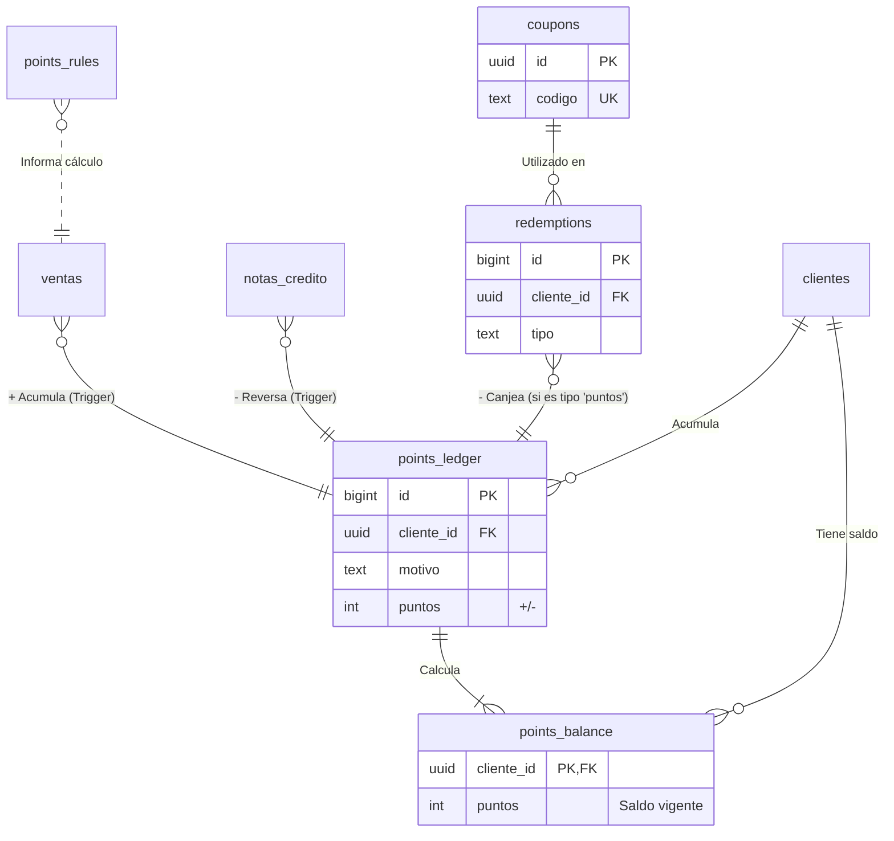

# [Sección 12] — Módulo de Fidelización de Clientes

## 1. Resumen del Módulo

Este módulo introduce un sistema de puntos y recompensas diseñado para incentivar la lealtad del cliente y fomentar la repetición de compras. La lógica principal se centra en la acumulación de puntos por compras y su posterior canje por beneficios.

**Relación con otros módulos:**
-   **Punto de Venta (POS):** Es el principal generador de puntos. El sistema está automatizado para que, al marcar una `venta` como `pagada`, se dispare un trigger que calcula y acredita los puntos correspondientes al cliente en un libro mayor (`points_ledger`). De forma similar, la creación de una `nota_credito` reversa los puntos de la venta original.
-   **Portal del Cliente:** A través del portal, los clientes pueden consultar su saldo de puntos actual (`points_balance`) y ver un historial detallado de todos sus movimientos (`v_points_movimientos`), proporcionando transparencia y fomentando el uso del programa.

**Componentes Clave:**
-   **Libro Mayor (`points_ledger`):** Tabla auditable que registra cada transacción de puntos (positiva o negativa), asegurando la trazabilidad.
-   **Saldos (`points_balance`):** Tabla desnormalizada para consultas rápidas del saldo de puntos vigente de cada cliente.
-   **Reglas (`points_rules`):** Define las condiciones para la acumulación de puntos (ej. 1 punto por cada $1 gastado).
-   **Canjes (`redemptions`):** Registra el uso de puntos o cupones.
-   **Cupones (`coupons`):** Permite la creación de códigos para descuentos o bonos especiales.

---

## 2. Diagrama de Entidades (Mermaid)



---

## 3. Cómo Aplicar la Estructura

Sigue estos pasos en el **SQL Editor** de tu proyecto Supabase para desplegar el módulo.

1.  **Ejecutar Script del Modelo de Datos:**
    -   Copia el contenido de `supabase/sql/21_fidelizacion_modelo.sql`.
    -   Pégalo en una nueva consulta y ejecútalo. Esto creará las tablas, funciones, triggers y vistas necesarias.

2.  **Ejecutar Script de Políticas de Seguridad (RLS):**
    -   Copia el contenido de `supabase/sql/22_rls_fidelizacion.sql`.
    -   Pégalo en una nueva consulta y ejecútalo. Esto activará RLS y aplicará las políticas de acceso para cada rol.

---

## 4. Pruebas Manuales de Políticas RLS

Ejecuta estas consultas para verificar que la lógica y los permisos funcionan como se espera. **Recuerda reemplazar los `<UUID_...>` por los IDs reales de tus usuarios y registros de prueba.**

### Como `admin@local` (Acumulación y Reversa)
```sql
DO $$
DECLARE
  -- Datos de prueba (asegúrate de que existan)
  test_client_id UUID := '<UUID_DE_UN_CLIENTE_DE_PRUEBA>';
  test_venta_id UUID := '<UUID_DE_UNA_VENTA_DE_ESE_CLIENTE>';
  puntos_antes INT;
  puntos_despues INT;
BEGIN
  -- Simular sesión de admin
  SET LOCAL ROLE authenticator;
  SET LOCAL "request.jwt.claims" TO jsonb_build_object('sub', '<UUID_DEL_ADMIN>', 'role', 'authenticated');

  SELECT puntos INTO puntos_antes FROM public.points_balance WHERE cliente_id = test_client_id;
  RAISE NOTICE '✅ [Admin] Puntos iniciales: %', COALESCE(puntos_antes, 0);

  RAISE NOTICE 'Marcando venta como "pagada"...';
  UPDATE public.ventas SET estado = 'pagada' WHERE id = test_venta_id;
  
  -- Verificar acumulación
  PERFORM pg_sleep(0.5); -- Dar tiempo al trigger
  SELECT puntos INTO puntos_despues FROM public.points_balance WHERE cliente_id = test_client_id;
  ASSERT puntos_despues > COALESCE(puntos_antes, 0), 'Fallo: Los puntos no se acumularon.';
  RAISE NOTICE 'ÉXITO: Puntos acumulados. Nuevo saldo: %', puntos_despues;
  
  RAISE NOTICE 'Creando nota de crédito para reversar puntos...';
  INSERT INTO public.notas_credito (venta_id, motivo, total, creada_por)
  VALUES (test_venta_id, 'Devolución de producto', (SELECT total FROM ventas WHERE id = test_venta_id), auth.uid());

  -- Verificar reversa
  PERFORM pg_sleep(0.5);
  SELECT puntos INTO puntos_despues FROM public.points_balance WHERE cliente_id = test_client_id;
  ASSERT puntos_despues = COALESCE(puntos_antes, 0), 'Fallo: Los puntos no se reversaron correctamente.';
  RAISE NOTICE 'ÉXITO: Puntos reversados. Saldo final: %', puntos_despues;
END $$;
```

### Como `recepcionista@local` (Canje de Puntos y Cupón)
```sql
DO $$
DECLARE
  test_client_id UUID := '<UUID_DE_UN_CLIENTE_DE_PRUEBA>';
  new_coupon_code TEXT := 'DESCUENTO25';
BEGIN
  -- Simular sesión de recepcionista
  SET LOCAL ROLE authenticator;
  SET LOCAL "request.jwt.claims" TO jsonb_build_object('sub', '<UUID_DE_RECEPCIONISTA>', 'role', 'authenticated');

  RAISE NOTICE '✅ [Recep] Canjeando 100 puntos...';
  -- Asegúrate de que el cliente tenga saldo. Puedes usar fn_points_accrue como admin primero.
  -- e.g., SELECT public.fn_points_accrue(test_client_id, 200, 'ajuste_manual', 'test');
  PERFORM public.fn_points_redeem(test_client_id, 100, 'OT-CANJE-123');
  RAISE NOTICE 'ÉXITO: Canje de puntos registrado.';

  RAISE NOTICE '✅ [Recep] Creando y canjeando un cupón...';
  INSERT INTO public.coupons (codigo, tipo, valor, descripcion)
  VALUES (new_coupon_code, 'descuento_fijo', 25000, 'Descuento especial');
  
  PERFORM public.fn_coupon_redeem(test_client_id, new_coupon_code, 'OT-CUPON-456');
  RAISE NOTICE 'ÉXITO: Canje de cupón registrado.';
END $$;
```

### Como Usuario Cliente (`cliente@local`)
```sql
DO $$
DECLARE
  test_user_id UUID := '<UUID_DEL_USUARIO_CLIENTE>'; -- Usuario vinculado a un cliente
  test_client_id UUID := (SELECT cliente_id FROM v_portal_identity WHERE user_id = test_user_id);
  record_count INT;
BEGIN
  SET LOCAL ROLE authenticator;
  SET LOCAL "request.jwt.claims" TO jsonb_build_object('sub', test_user_id::text, 'role', 'authenticated');

  RAISE NOTICE '✅ [Cliente] Leyendo su propio resumen de puntos...';
  SELECT count(*) INTO record_count FROM public.v_points_resumen;
  ASSERT record_count = 1, 'Fallo: Cliente no pudo ver (o vio más de) su propio resumen.';
  RAISE NOTICE 'ÉXITO: Cliente vio su resumen.';

  RAISE NOTICE '❌ [Cliente] Intentando leer saldos de otros... (Debe devolver 0 filas)';
  SELECT count(*) INTO record_count FROM public.points_balance WHERE cliente_id != test_client_id;
  ASSERT record_count = 0, 'Fallo: Cliente vio saldos de otros.';
  RAISE NOTICE 'ÉXITO: Cliente no puede ver saldos ajenos.';
END $$;
```

---

## 5. Checklist de Verificación de Permisos

| Rol           | Ver Saldo/Mov. (Propio) | Ver Saldo/Mov. (Otros) | Acumular Puntos (vía Venta) | Canjear Puntos/Cupón | Crear/Editar Reglas y Cupones |
| :------------ | :---------------------: | :--------------------: | :-------------------------: | :------------------: | :---------------------------: |
| **Admin**     |           ✅            |           ✅           |              ✅             |          ✅          |               ✅              |
| **Recep.**    |           ✅            |           ✅           |              ✅             |          ✅          |               ✅              |
| **Técnico**   |           ❌            |           ❌           |              N/A            |          ❌          |               ❌              |
| **Cliente**   |           ✅            |           ❌           |              ✅             |          ❌          |               ❌              |

---

## 6. Tareas Pendientes (TODOs)

-   [ ] **Expiración de Puntos:**
    -   Crear un Cron Job en Supabase que ejecute una función `public.fn_expire_points()` diariamente.
    -   Esta función debe buscar en `points_ledger` los registros con `vence_at` que ya pasaron, crear una entrada negativa de anulación y recalcular los saldos.

-   [ ] **Reglas de Acumulación Avanzadas:**
    -   Ampliar la tabla `points_rules` para incluir `categoria_producto_id` o `marca_id`.
    -   Modificar el trigger `fn_points_on_venta_pagada` para que, en lugar de aplicar una regla global, busque la regla más específica que aplique a los ítems de la venta.

-   [ ] **Bonificaciones Especiales:**
    -   Desarrollar funciones `public.fn_grant_birthday_bonus()` y `public.fn_grant_campaign_bonus(campaign_id)` para acreditar puntos por eventos especiales.

-   [ ] **Integración con la Interfaz de Usuario (UI):**
    -   Mostrar el saldo de puntos del cliente de forma prominente en el dashboard del portal.
    -   Crear una vista detallada en el portal que consuma los datos de `v_points_movimientos`.
    -   Añadir una opción en el POS para aplicar un canje de puntos como forma de pago o descuento en una venta.
