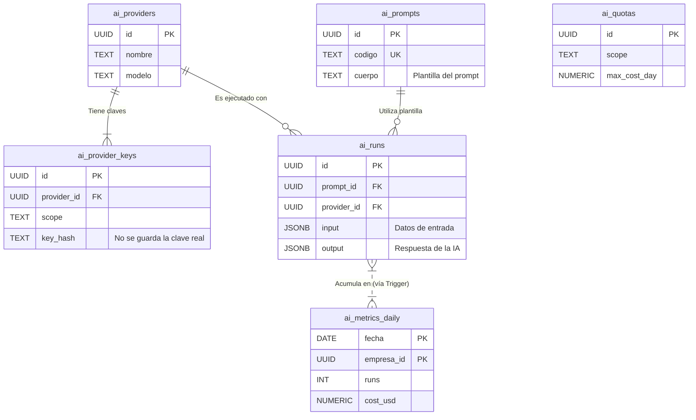

# [Sección 13] — Módulo de Configuración y Observabilidad de IA

## 1. Resumen del Módulo

Este módulo establece un marco centralizado para la gestión, control y monitorización del uso de servicios de Inteligencia Artificial (IA) dentro de la plataforma. Su objetivo es proporcionar total observabilidad sobre las ejecuciones, gestionar los costos asociados y aplicar un control de acceso granular para garantizar un uso seguro y eficiente de los modelos de IA.

**Objetivos Clave:**
-   **Gobernanza:** Centralizar la configuración de proveedores de IA (ej. Gemini, OpenAI), modelos y claves de API en un único lugar.
-   **Control de Costos:** Rastrear el uso de tokens y el costo estimado de cada ejecución, agregando métricas diarias y permitiendo la definición de cuotas de uso por usuario o empresa.
-   **Observabilidad y Auditoría:** Mantener un registro detallado (`ai_runs`) de cada solicitud y respuesta de la IA, permitiendo analizar el rendimiento y depurar problemas.
-   **Seguridad y Permisos:** Utilizar RLS para controlar quién puede configurar proveedores, gestionar prompts y acceder a los registros de ejecuciones.

---

## 2. Diagrama de Entidades (Mermaid)

El siguiente esquema ilustra las relaciones entre las tablas principales del módulo de IA.



---

## 3. Cómo Aplicar la Estructura

Sigue estos pasos en el **SQL Editor** de tu proyecto Supabase para desplegar el módulo completo.

1.  **Ejecutar Script del Modelo de Datos:**
    -   Copia el contenido de `supabase/sql/23_ai_config_modelo.sql`.
    -   Pégalo en una nueva consulta y ejecútalo. Esto creará todas las tablas, funciones, triggers y vistas del módulo.

2.  **Ejecutar Script de Políticas de Seguridad (RLS):**
    -   Copia el contenido de `supabase/sql/24_rls_ai_config.sql`.
    -   Pégalo en una nueva consulta y ejecútalo. Esto activará RLS en todas las tablas y aplicará las políticas de acceso para cada rol.

---

## 4. Flujo de Operación

El uso del módulo sigue un ciclo de vida claro desde la configuración hasta la monitorización.

1.  **Configurar Proveedor y Clave (Solo Admin):**
    -   Un administrador inserta un registro en `public.ai_providers` para definir un modelo disponible (ej. `nombre: 'gemini', modelo: 'gemini-2.5-flash'`).
    -   Luego, añade una clave en `public.ai_provider_keys`, asociándola al proveedor. **Importante:** Solo se almacena un alias legible (`key_alias`) y un hash o los últimos 4 dígitos de la clave (`key_hash`), **nunca la clave completa**. La clave real debe ser gestionada como un secreto en el entorno del backend.

2.  **Registrar Prompts (Admin/Recepcionista):**
    -   Se crean plantillas reutilizables en `public.ai_prompts` para estandarizar las interacciones con la IA (ej. un prompt con código `ot.resumen` para resumir diagnósticos).

3.  **Insertar un "Run" desde la Aplicación:**
    -   Cuando el backend ejecuta una tarea de IA, inserta un registro en `public.ai_runs`.
    -   El campo `input` almacena un snapshot de los datos usados para construir el prompt final.
    -   El campo `output` almacena la respuesta cruda de la IA.

    **Ejemplo de `input` (JSON):**
    ```json
    {
      "ot_id": "a1b2c3d4-...",
      "diagnostico_tecnico": "Se detectó un fallo en el capacitor de flujo. La unidad de almacenamiento SSD presenta sectores defectuosos. Se recomienda el reemplazo del SSD y la recalibración del capacitor.",
      "historial_cliente": "El cliente reportó ruidos extraños y lentitud general."
    }
    ```

    **Ejemplo de `output` (JSON):**
    ```json
    {
      "resumen_cliente": "Tu equipo tiene un problema en el disco duro y un componente eléctrico. Recomendamos cambiar el disco para solucionar la lentitud y reparar el otro componente para evitar futuros fallos.",
      "riesgos": ["Pérdida de datos si no se reemplaza el SSD", "Fallo total del equipo si no se repara el capacitor"],
      "costo_estimado_partes_usd": 120.50
    }
    ```

4.  **Consultar Métricas y Cuotas:**
    -   El trigger `trg_ai_metrics_accumulate` actualiza automáticamente la tabla `public.ai_metrics_daily` después de cada inserción en `ai_runs`.
    -   Los administradores o usuarios de empresa (según las políticas RLS) pueden consultar esta tabla para monitorizar el consumo diario, de la misma forma que pueden leer `ai_quotas` para ver los límites establecidos.

---

## 5. Buenas Prácticas y Seguridad

-   **No Guardar Información Personal Identificable (PII):** Evita almacenar datos sensibles (nombres, direcciones, emails, etc.) en los campos `input` y `output` de `ai_runs`. Si es necesario procesar PII, debe ser anonimizada **antes** de guardarla en la base de datos (ej. usando técnicas de hashing o mascarado).
-   **Limitar Retención de Datos:** Establece una política de retención para los registros de `ai_runs`. Un job programado debería purgar periódicamente los registros antiguos, especialmente el campo `output` que puede contener información detallada, para minimizar la superficie de exposición de datos.
-   **Monitorización Activa y Cuotas:** No te limites a registrar los datos; monitoriza activamente la vista `v_ai_runs_resumen` y la tabla `ai_metrics_daily`. Define cuotas realistas en `ai_quotas` para cada cliente o para el sistema global para prevenir facturas inesperadas por parte del proveedor de IA.

---

## 6. Checklist y Tareas Pendientes (TODOs)

### ✅ Checklist de Verificación
-   [ ] Se han ejecutado los scripts `23_..._modelo.sql` y `24_..._rls.sql` sin errores.
-   [ ] Las políticas RLS están activadas para todas las tablas del módulo.
-   [ ] El trigger `trg_ai_metrics_accumulate` está activo en la tabla `ai_runs`.
-   [ ] Las políticas RLS permiten a un `recepcionista` leer y crear `ai_prompts`, pero no `ai_providers`.
-   [ ] Las políticas RLS permiten a un `admin` gestionar todas las tablas del módulo.

### 📝 Tareas Pendientes (TODOs)
-   [ ] **Rotación de Claves:** Crear un job programado (ej. Supabase Cron Job) que revise la antigüedad de las claves en `ai_provider_keys` y envíe una notificación a los administradores cuando una clave esté próxima a expirar o deba ser rotada por política de seguridad.
-   [ ] **Borrado de Outputs Antiguos:** Implementar un job programado que ejecute una limpieza periódica de `ai_runs.output` para registros que superen una antigüedad definida (ej. 90 días), reemplazando el JSON por un mensaje como `{"purged": true}` para cumplir con las políticas de retención.
-   [ ] **Alertas de Cuotas:** Desarrollar una Supabase Edge Function que se ejecute periódicamente, compare los datos de `ai_metrics_daily` contra los límites en `ai_quotas` y envíe una alerta (ej. por email o a un canal de Slack) si el consumo supera un umbral predefinido (ej. 80% del `max_cost_day`).